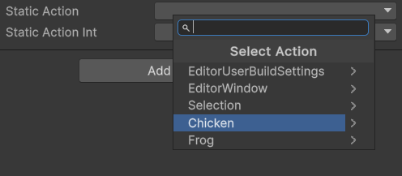
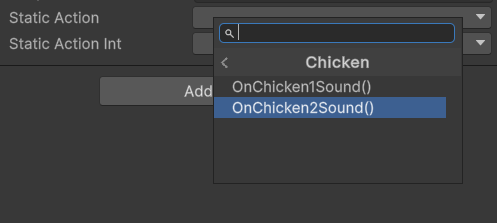
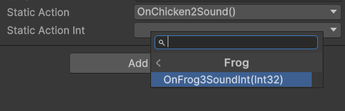
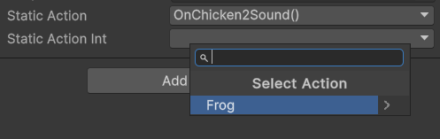

# Unity Static Action Dropdown

Dropdown selection for `public static Action action;`. This is a simple editor script that allows you to select a static action from a dropdown list. This package can make it possible to decouple your code and also decouple your inspector. Normally we can use UnityEvent, but that makes the editor full of mess of reference. This package is a simple solution for that. One good use case is to manage SFX.

## ✨ Preview
Dropdown showing list of classes



Dropdown showing list of `public static Action` in a class



Dropdown showing list of classes with specific generic argument



Dropdown showing list of `public static Action` in a class with specific generic argument



## 📖 How to Use

Create the object in the class you wanted. Make sure the namespace is included.
```C#
using DhafinFawwaz.ActionExtensionsLib;

// ...

public StaticAction action;
public StaticAction<string> actionStr;

void OnEnable() {
    action += () => {
        Debug.Log("Hello World!");
    };
    actionStr += (val) => {
        Debug.Log("Hello " + val);
    };
}
void OnDisable() {
    action.RemoveAllListener(); // THIS IS IMPORTANT!. If you forget to remove the listener, the function will just stay there, never freed from memory. Can also cause unexpected bug.
    actionStr.RemoveAllListener();
}
```

Make sure the action is public and static, for example
```C#
public class PlayerController : MonoBehaviour {
    // ...
    public static Action OnPlayerHurt;
    public static Action<string> OnPlayerDeath;
    // ...

    public void Hurt() {
        // ...
        OnPlayerHurt?.Invoke();
        // ...
    }

    public void Death() {
        // ...
        OnPlayerHurt?.Invoke("Oh nooooo!");
        // ...
    }

}
```

That's it! You can now select PlayerController.OnPlayerHurt from the dropdown list.